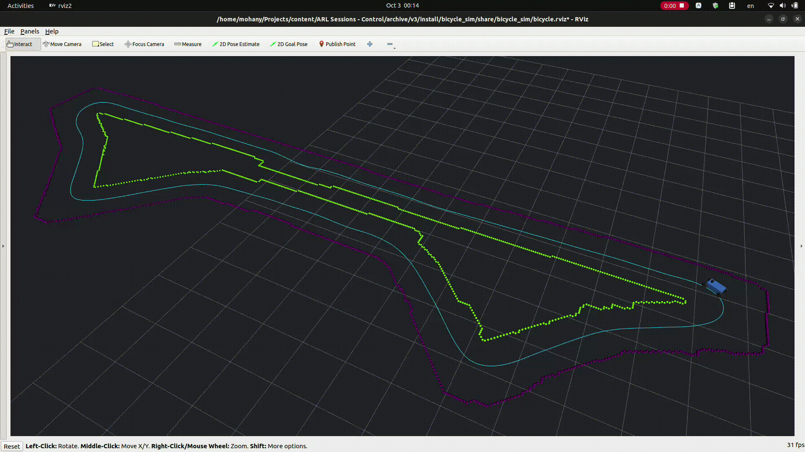
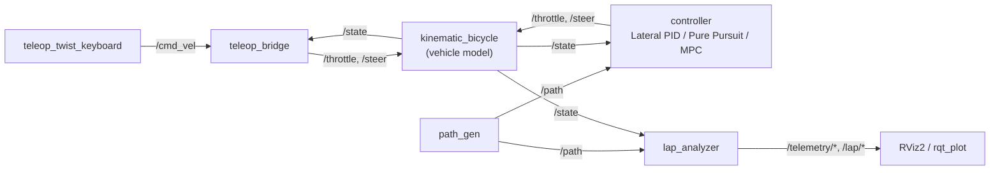

Demo Video Link: https://drive.google.com/drive/u/0/folders/1orxgwBInC5qwyyq_5zr4FfcGEf1UWAXh
# ARL Autonomous Vehicle Control Track

**Autotronics Research Lab (ARL) — Ain Shams University**  
*Course: Autonomous Vehicles & Drive-by-Wire Systems | Individual Project*

<p align="center">
  
</p>

---

**Student:** Ahmed Khaled Mohamed Abdullfatah | **ID:** 23p0364 | **Setup:** ROS 2 Jazzy on Ubuntu 24.04

## System Architecture

| Package | Responsibility |
|---|---|
| `bicycle_sim` | Vehicle model, simulator node, URDF and RViz configuration |
| `bicycle_control` | Teleop bridge, longitudinal PID, velocity profiler and the three lateral controllers |
| `track_environment` | Track loading, path publishing, boundary cones and the lap analyzer |



Only one source of commands runs at a time: the teleop bridge or the autonomous controller, selected with the `controller:=` launch argument. Every loop runs at 10 Hz. The lap analyzer only observes.

## Milestone 1: System Discovery

The base launch starts five nodes: `kinematic_bicycle` (vehicle model), `path_gen`, `lap_analyzer`, `robot_state_publisher` and `rviz2`. The graph was inspected with:

```bash
ros2 node list
ros2 topic list -t
ros2 topic hz /state
ros2 interface show nav_msgs/msg/Odometry
ros2 topic echo /state --once
```

| Topic | Message type | Direction | Content and units |
|---|---|---|---|
| `/throttle` | `std_msgs/msg/Float32` | controller → car | Normalised effort in [-1, 1]; positive drives, negative brakes |
| `/steer` | `std_msgs/msg/Float32` | controller → car | Front steering angle in rad, positive = left, limited to ±0.61 rad (35°) |
| `/state` | `nav_msgs/msg/Odometry` | car → controllers, analyzer | Rear-axle position (m) and yaw in the `map` frame, forward speed (m/s), yaw rate (rad/s) |
| `/path` | `nav_msgs/msg/Path` | path_gen → controllers, analyzer | Centerline waypoints (m) with heading |
| `/track_bounds` | `visualization_msgs/msg/MarkerArray` | path_gen → RViz | Boundary cones |
| `/joint_states`, `/tf` | `sensor_msgs/msg/JointState`, `tf2_msgs/msg/TFMessage` | car → RViz | Wheel and steering joint angles (rad), car pose |
| `/telemetry/*`, `/lap/*` | see Milestone 5.5 | analyzer → plots, RViz | Tracking error, speed, lap time, markers |
| `/cmd_vel` | `geometry_msgs/msg/Twist` | keyboard → teleop bridge | Teleop mode only: m/s and rad/s |

The car can only be commanded through `/throttle` and `/steer`, and the only feedback is `/state`, so every controller reads `/state` and `/path` and writes those two topics.

Live plotting:

```bash
ros2 run rqt_plot rqt_plot /state/twist/twist/linear/x /throttle/data /steer/data
ros2 run plotjuggler plotjuggler   # Streaming → ROS2 Topic Subscriber → select /state, /throttle, /steer
```

## Milestone 2: Extended Kinematic Bicycle Model

State $\mathbf{x} = [x, y, \theta, v]^T$ (rear-axle position, heading, forward speed). Input $\mathbf{u} = [u_{th}, \delta]^T$ (throttle, steering angle).

$$\dot{x} = v\cos\theta \qquad \dot{y} = v\sin\theta \qquad \dot{\theta} = \frac{v}{L}\tan\delta \qquad \dot{v} = k_a u_{th} - c_{drag}v^2 - c_{roll}v$$

Parameters: $L$ = 1.25 m, $k_a$ = 4.0 m/s², $c_{drag}$ = 0.005 1/m, $c_{roll}$ = 0.05 1/s, steering limit 35°, speed limit 25 m/s, time step 0.1 s.

The state is integrated with forward Euler, $\mathbf{x}_{k+1} = \mathbf{x}_k + f(\mathbf{x}_k, \mathbf{u}_k) \Delta t$, followed by two constraints:

- **Heading wrapping:** $\theta \leftarrow ((\theta + \pi) \bmod 2\pi) - \pi$, which keeps the yaw in $[-\pi, \pi)$.
- **Speed clamping:** $v \leftarrow \min(\max(v, 0), v_{max})$, so braking cannot drive the car backwards.

Verification with direct actuator commands:

| Test | Expected from the equations | Result |
|---|---|---|
| `/throttle` = 0.5 | Speed settles where $4 \cdot 0.5 = 0.005v^2 + 0.05v$, i.e. 15.62 m/s | 15.62 m/s |
| `/steer` = 0.30 rad | Circle of radius $L/\tan\delta$ = 4.04 m | 4.04 m (15.62 m/s ÷ 3.864 rad/s) |
| `/throttle` = −1.0 | Car stops, speed never negative | 0.0 m/s |

## Milestone 3: Keyboard Teleoperation Bridge

`teleop_twist_keyboard` publishes a `geometry_msgs/Twist` on `/cmd_vel`. The bridge translates it into the two actuator topics with an open-loop mapping:

$$u_{th} = \mathrm{clip}\left(\frac{v_{cmd}}{v_{full}}, -1, 1\right) \qquad \delta = \mathrm{clip}\left(\frac{\omega_{cmd}}{\omega_{full}} \delta_{max}, -\delta_{max}, \delta_{max}\right)$$

with $v_{full}$ = 5 m/s, $\omega_{full}$ = 1 rad/s and $\delta_{max}$ = 0.61 rad (35°). For example, a `Twist` of (2.5 m/s, 0.5 rad/s) maps to a throttle of 0.5 and a steering angle of 0.305 rad.

**Safety watchdog:** the commands are republished at 10 Hz. If no `Twist` has arrived for more than 0.5 s, throttle and steering are set to zero, so the car coasts instead of running away when the key is released or the connection drops.

## Milestone 4: Longitudinal PID Cruise Control

$$e_k = v_{target} - v_k$$

$$I_k = \mathrm{clip}\left(I_{k-1} + e_k \Delta t, -I_{max}, I_{max}\right)$$

$$u_k = \mathrm{clip}\left(K_p e_k + K_i I_k + K_d \frac{e_k - e_{k-1}}{\Delta t}, -1, 1\right)$$

with $K_p$ = 1.0, $K_i$ = 0.2, $K_d$ = 0.05, $\Delta t$ = 0.1 s and $I_{max}$ = 2.0. The P term reacts to the present error, the I term removes the steady-state error caused by drag, and the D term damps the approach to the target.

**Anti-windup:** the integral is clamped to $\pm I_{max}$. When the car launches from standstill the throttle is saturated at 1.0 for about a second. Without the clamp the integral would keep growing during that time and cause a large overshoot.

**Cruise integration:** with `use_cruise_control:=true` the teleop bridge treats `linear.x` as a target speed. It reads the measured speed from `/state` and publishes the PID output on `/throttle`. The 0.5 s watchdog still applies.

**Verification:** with a 4.0 m/s request the car settled at 4.0 m/s. Holding that speed needs a throttle of $(0.005 \cdot 4^2 + 0.05 \cdot 4)/4 = 0.07$, which is the resistance at that speed and is supplied by the integral term. With the open-loop mapping of Milestone 3 the same request is a fixed throttle of 0.8, for which the model gives a terminal speed of 20.8 m/s.

## Milestone 5: Autonomous Path Tracking

### 5.1 Velocity Profiler

A car at speed $v$ on a path of curvature $\kappa$ has a lateral acceleration $a_{lat} = v^2|\kappa|$. Limiting it to 5 m/s² gives the target speed:

$$v_{target} = \min\left(v_{max}, \sqrt{\frac{a_{lat,max}}{|\kappa|}}\right)$$

On a straight the target is $v_{max}$ (7.5 m/s), and a corner of radius 2 m ($\kappa$ = 0.5) gives 3.16 m/s. The curvature is estimated by the controller node as the change in path heading between neighbouring waypoints divided by their distance, and the target speed is tracked by the longitudinal PID.

**Observation:** the centerline file contains some out-of-order waypoints. At those points the heading difference is close to 180°, which gives unrealistically high curvature samples and short braking pulses, visible as ripple in the speed signal.

### 5.2 Lateral PID

The controller steers from the cross-track error $e$ (m, positive when the car is left of the path) and the heading error $\psi_e = \psi_{car} - \psi_{path}$:

$$\delta = \mathrm{clip}\left(-\left(K_p e + K_i \int e dt + K_d \dot{e}\right) - K_\psi \psi_e, -\delta_{max}, \delta_{max}\right)$$

with $K_p$ = 0.8, $K_i$ = 0.02, $K_d$ = 0.15, $K_\psi$ = 0.5 and the integral clamped to ±1.0.

| Situation | Error | Required steering |
|---|---|---|
| Car left of the path | $e > 0$ | Right ($\delta < 0$) |
| Car right of the path | $e < 0$ | Left ($\delta > 0$) |
| Nose pointing left of the path | $\psi_e > 0$ | Right ($\delta < 0$) |

**Direction guard:** if the heading error is larger than 90°, the reference segment is pointing backwards (the out-of-order waypoints mentioned above), so 180° is removed from the heading error and the sign of $e$ is flipped.

**Behaviour:** the car completes laps, but the controller is purely reactive. It only steers after an error has appeared, so it wobbles around the path and has its largest error in corners.

### 5.3 Pure Pursuit

Pure Pursuit is a geometric controller. It picks a goal point on the path a look-ahead distance in front of the car and steers along the circular arc that reaches it.

1. **Adaptive look-ahead:** $L_d = \mathrm{clip}(k_v v + L_{min}, L_{min}, L_{max})$ with $k_v$ = 0.25 s, $L_{min}$ = 0.8 m and $L_{max}$ = 2.5 m.
2. **Target selection:** find the waypoint nearest to the car, then walk forward along the closed path to the first waypoint that is at least $L_d$ away.
3. **Goal point in the vehicle frame:** $y_l = -\sin\psi \Delta x + \cos\psi \Delta y$, the lateral offset of the goal as seen from the car.
4. **Arc steering law:** the arc through the rear axle and the goal has curvature $2 y_l / L_d^2$, and the bicycle model gives the steering angle:

$$\delta = \arctan\left(\frac{2 L y_l}{L_d^2}\right)$$

**Behaviour:** because it looks ahead, it starts turning before the corner and is much smoother and more accurate than the Lateral PID. Its weakness is the look-ahead trade-off: a short distance tracks tightly but can oscillate, while a long distance is smooth but cuts corners.

### 5.4 Extended Kinematic MPC

At every control step the MPC solves an optimisation problem over a horizon of $N$ = 10 steps (1 s). The decision variables are $\mathbf{u} = [\delta_0, a_0, \dots, \delta_{N-1}, a_{N-1}]$, with the steering bounded to ±0.61 rad and the acceleration to ±4 m/s².

**Prediction model** (the bicycle model of Milestone 2, with the speed driven by the acceleration input):

$$x_{k+1} = x_k + v_k\cos\psi_k \Delta t \qquad y_{k+1} = y_k + v_k\sin\psi_k \Delta t$$

$$\psi_{k+1} = \psi_k + \frac{v_k}{L}\tan\delta_k \Delta t \qquad v_{k+1} = v_k + a_k \Delta t$$

**Frenet-frame errors** against the reference pose $(x_r, y_r, \psi_r)$:

$$e_{long} = \cos\psi_r \Delta x + \sin\psi_r \Delta y \qquad e_{lat} = -\sin\psi_r \Delta x + \cos\psi_r \Delta y \qquad e_\psi = \sin(\psi - \psi_r)$$

**Cost function:**

$$J = \sum_{k=0}^{N-1}\left[w_{lat}e_{lat}^2 + w_{long}e_{long}^2 + w_\psi e_\psi^2 + w_v(v - v_{ref})^2 + w_\delta\delta_k^2 + w_{\Delta\delta}(\delta_k - \delta_{k-1})^2 + w_a a_k^2\right]$$

The weights are 30 (lateral), 1 (longitudinal), 10 (heading), 1 (speed), 0.2 (steering), 6 (steering change) and 0.1 (acceleration).

- **Why Frenet:** it lets the lateral error be penalised 30 times more than being slightly ahead or behind along the path.
- **Why sin for the heading error:** it has no jump at ±180°.
- **Receding horizon:** only the first control is applied ($\delta_0$ as steering, $a_0 / k_a$ as throttle). At the next step the problem is solved again from the newly measured state.
- **Warm start:** the previous solution, shifted by one step, is the initial guess, so the solver (SciPy SLSQP, at most 25 iterations) starts close to the answer.

**Behaviour:** this is the most accurate controller and the most expensive to compute. In this mode the reference speed is a constant 4 m/s, so laps are slower than with the other two. The measured cruise speed is about 3.6 m/s, slightly below the reference, because the prediction model has no drag term and so under-estimates the throttle the real car needs.

### 5.5 Lap Analyzer and Telemetry

For every `/state` message the lap analyzer projects the rear axle onto the nearest path segment, which gives the cross-track error (CTE), the heading error and the distance along the track. A lap is counted when that distance wraps from the end of the track back to the start. After every lap it prints the lap time, the best lap, the mean, maximum and RMS cross-track error, and the mean and top speed.

$$e_{RMS} = \sqrt{\frac{1}{n}\sum_{i=1}^{n} e_i^2}$$

| Topic | Type | Content |
|---|---|---|
| `/telemetry/cte` | `std_msgs/msg/Float32` | Signed cross-track error (m), positive when the car is left of the path |
| `/telemetry/speed` | `std_msgs/msg/Float32` | Speed (m/s) |
| `/telemetry/heading_err_deg` | `std_msgs/msg/Float32` | Heading error (deg) |
| `/telemetry/lap_time` | `std_msgs/msg/Float32` | Time in the current lap (s) |
| `/lap/metrics` | `std_msgs/msg/String` | The same values plus lap number, last and best lap, as JSON |
| `/lap/visualization` | `visualization_msgs/msg/MarkerArray` | RViz dashboard markers |

**RViz dashboard markers:**

- **Start gate** (provided).
- **CTE whisker:** a line from the rear axle to its projection on the path, green while the error is below 0.2 m and red above it.
- **HUD:** text floating above the car with the lap number, lap time, speed, CTE and best lap.

## 🏆 Telemetry Benchmark Leaderboard

Each autonomous controller was run for three consecutive laps of `centerline_0.csv` from a standing start. The values are the ones printed by the lap analyzer: the best of the three lap times, and the error statistics over every sample of the three laps.

| Controller Mode | Best Lap Time (s) | Top Speed (m/s) | Mean CTE (m) | Max CTE (m) | RMS CTE (m) | Laps Completed / Status |
|---|---|---|---|---|---|---|
| **Manual Teleoperation** | — | — | — | — | — | Driven by keyboard for the demo; no full timed lap |
| **Lateral PID (Reactive)** | 76.96 | 7.52 | 0.175 | 0.768 | 0.218 | 3 laps completed |
| **Pure Pursuit (Preview)** | 72.10 | 7.45 | 0.034 | 0.384 | 0.057 | 3 laps completed |
| **Extended Kinematic MPC (Optimal)** | 123.10 | 3.94 | 0.016 | 0.337 | 0.045 | 3 laps completed |

### Critical Comparison

**Accuracy.** The mean cross-track error falls by a factor of five from the Lateral PID (0.175 m) to Pure Pursuit (0.034 m), and by another factor of two to the MPC (0.016 m). The RMS values follow the same order.

**Lap time.** The Lateral PID weaves around the centerline: it drove about 461 m per lap against 444 m for the other two, which is part of why its lap is slower than Pure Pursuit's on the same velocity profiler. The MPC lap is the slowest only because that mode uses a constant 4 m/s reference speed instead of the profiler, so lap time is not a like-for-like comparison for it.

**Limits of this comparison.** The MPC ran at roughly half the speed of the other two, and part of its accuracy advantage comes from that. The maximum errors of Pure Pursuit and MPC are isolated single-sample spikes at the out-of-order waypoints, where the analyzer's projection briefly picks a wrong segment, so the mean and RMS are the more representative figures.

| | Lateral PID | Pure Pursuit | MPC |
|---|---|---|---|
| Information used | Current error only | One point ahead | Ten points ahead (1 s) and a vehicle model |
| Tuning | Four gains, valid around one speed | Mainly the look-ahead distance | Cost weights and horizon |
| Computation | Negligible | Negligible | An optimisation at every step |
| Main weakness | No preview, sensitive to speed | Cuts corners with a long look-ahead | Needs an accurate model |

### Why MPC Tracks Better than Pure Pursuit and Lateral PID

1. **It previews the upcoming path.** The Lateral PID needs an error before it acts. A corner of radius 3 m needs a steering angle of $\arctan(1.25/3) = 0.39$ rad, and with $K_p$ = 0.8 the proportional term can only supply that with a cross-track error of about 0.5 m, which is why its largest errors are in corners. Pure Pursuit looks ahead, but at a single point, so it cuts corners when the curvature changes. The MPC compares its predicted position with ten reference poses over the next second.
2. **It predicts the effect of its own commands.** Using the vehicle model, it starts and ends a turn at the right moment and plans steering and speed together. Pure Pursuit uses the bicycle geometry for one arc only, and the PID uses no model at all.
3. **It minimises the tracking error directly, within the actuator limits.** The lateral and heading errors are the largest terms of the cost, and the steering and acceleration bounds are constraints of the optimisation. The other two controllers follow fixed laws and clip the command afterwards.
4. **It re-plans every 0.1 s.** With the receding horizon, feedback from the measured state corrects model errors such as the missing drag term.

The price is that its accuracy depends on the model and that it is the most expensive controller to compute.

## Milestone 6: Free Exploration

**Main topic: four-wheel Ackermann steering.** The bicycle model merges the two front wheels into one wheel on the centreline. On a real car the two front wheels follow circles of different radii around the same turning centre, so they need different angles:

$$\tan\delta_{inner} = \frac{L}{R - W/2} \qquad \tan\delta_{outer} = \frac{L}{R + W/2}$$

where $R = L/\tan\delta$ is the turning radius of the rear-axle centre. Applied to this project's car ($L$ = 1.25 m, $W$ = 1.18 m):

| Bicycle angle | Radius $R$ | Inner wheel | Outer wheel | Difference |
|---|---|---|---|---|
| 5° | 14.29 m | 5.2° | 4.8° | 0.4° |
| 20° | 3.43 m | 23.7° | 17.3° | 6.5° |
| 35° (steering limit) | 1.79 m | 46.3° | 27.8° | 18.5° |

The bicycle model is therefore an excellent approximation for gentle steering, but on this short and wide car the two wheels differ by 18.5° at full lock. The simulator's RViz model sends the same angle to both front hinges, which on a real vehicle would scrub the tyres.

In `ros2_control` this is handled by the steering controllers library, which provides `bicycle_steering_controller`, `tricycle_steering_controller` and `ackermann_steering_controller`. Each takes a body-velocity reference (`geometry_msgs/msg/TwistStamped`, using linear x and angular z), converts it through the kinematic model into a position command for each steering joint and a velocity command for each traction joint, and publishes odometry. The Ackermann variant has two steering joints and two traction joints, so the inner and outer wheels are commanded separately.

**2D vs 3D simulation.** The 2D kinematic simulator used here is cheap and deterministic: laps 2 and 3 of Pure Pursuit both took 72.10 s. But it has no tyre slip. At 7.5 m/s in a 2 m radius corner the lateral acceleration would be 28 m/s², almost 3 g, which no road tyre can deliver, and only the velocity profiler's limit keeps the speeds realistic. Gazebo simulates 3D rigid-body dynamics, tyre friction and sensors at a much higher computational cost, and MVSim is a lighter planar simulator in between. A 2D simulator is the right tool for developing control logic, and a 3D engine for validating it before real hardware.

**Deterministic MPC vs sampling-based MPPI.** The MPC in this project refines a single trajectory with a gradient-based solver, so its cost must be smooth. The Nav2 MPPI controller adds Gaussian noise to the previous best control sequence, simulates by default 1000 trajectories of 56 steps (2.8 s), scores them with plug-in critics and takes a soft-max weighted average. Its cost functions need not be convex or differentiable, so obstacles can be read directly from a costmap, and it supports differential, omni and Ackermann motion models. The price is far more computation and a stochastic result.

**References:**

- [ros2_controllers: Steering Controllers Library](https://control.ros.org/jazzy/doc/ros2_controllers/steering_controllers_library/doc/userdoc.html)
- [Nav2: Model Predictive Path Integral Controller](https://docs.nav2.org/configuration/packages/configuring-mppic.html)
- [Ackermann Vehicle in Gazebo (gz-sim) and ROS 2](https://github.com/alitekes1/ackermann-vehicle-gzsim-ros2)
- [MVSim Multi-Vehicle Simulator](https://docs.ros.org/en/humble/Tutorials/Advanced/Simulators/MVSim/Simulation-MVSim.html)

## Reproduction Guide

```bash
# 1. Install (ROS 2 Jazzy, Ubuntu 24.04)
source /opt/ros/jazzy/setup.bash
sudo apt update && sudo apt install -y python3-colcon-common-extensions python3-numpy python3-scipy \
  ros-jazzy-robot-state-publisher ros-jazzy-rviz2 ros-jazzy-xacro \
  ros-jazzy-teleop-twist-keyboard ros-jazzy-rqt-plot

# 2. Build
cd ~/Control_Project-main
colcon build --symlink-install
source install/setup.bash

# 3. Run one mode: teleop | lateral_pid | pure_pursuit | mpc
ros2 launch bicycle_sim bicycle_sim.launch.py controller:=pure_pursuit

# Keyboard driving (second terminal, with controller:=teleop)
ros2 run teleop_twist_keyboard teleop_twist_keyboard

# Cruise control test (with controller:=teleop use_cruise_control:=true)
ros2 topic pub -r 10 /cmd_vel geometry_msgs/msg/Twist "{linear: {x: 4.0}}"

# Live plots
ros2 run rqt_plot rqt_plot /telemetry/cte /telemetry/speed
```

To reproduce the benchmark, launch a mode, let the car complete three laps, and read the `TABLE ROW` line that the lap analyzer prints after `LAP 3`.
